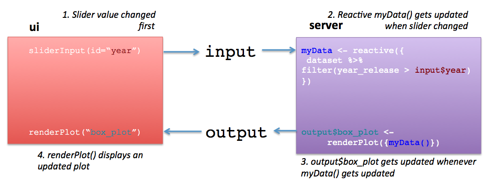

# App 2: Reactives

So we've connected our control up. Great! Now let's add a numeric filter to our data by using an `reactive`. `reactive`s are the heart and soul of `shiny`. We'll use a `reactive` to filter our data, and pass this filtered data on to our two plots. This means we can dynamically filter our data and our plots will update. 

A `reactive` can be thought of a bit of code that runs whenever the controls that map to it are changed. In this case, our `reactive` represents our filtered dataset when we adjust our slider.



## Exercise

1. Open up the `02_reactives` folder and the `app.R` file within.

2. Try running the app. You can see that we added a slider (using `sliderInput`) in `ui`, but it doesn't do anything. We're going to connect that slider to filter the `biopics` dataset. 

3. You might notice that there is a new object in the `server` code, called `biopics_filtered`. This is where we're going to connect our slider.

4. Paste the following bit of code into the reactive, after `biopics`. What does it do?

```
%>% filter(year_release > input$year_filter)
```
5. Notice how we call the reactive in `output$scatter_plot`? We have to use `biopics_filtered()` rather than `biopics_filtered`. A reactive is actually a function, and so you need to use the function notation to invoke it in a `renderPlot` statement.

6. Ok, run the app again and adjust the slider. Notice how the top plot is changing but the bottom one isn't. Why isn't it running?

7. Modify the code in `output$boxoffice_boxplot` to use the `biopics_filtered()` reactive. Where should you put it? Run the code again to make sure it works.

## For More Info

We've only shown one type of `reactive`, basically a `reactive` `data.frame`. Almost any type of object can be a `reactive`. Here are more resources on learning about them.

+   [Reactivity 101 (Dean Attali)](https://deanattali.com/blog/building-shiny-apps-tutorial/#10-reactivity-101) - Dean Attali's pages on Shiny are a good read, especially his section on reactives.
+   [Reactivity: An Overview (Official Shiny Documentation)](https://shiny.rstudio.com/articles/reactivity-overview.html) - I personally find this overview of `reactive`s a little confusing.
